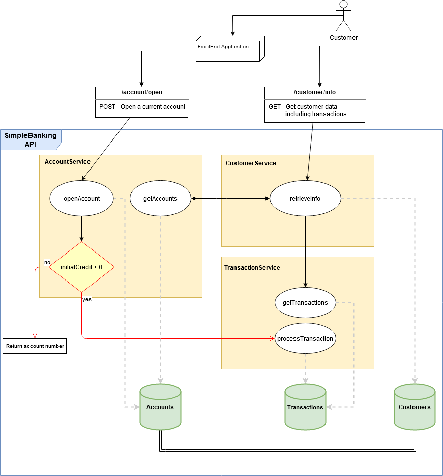

# SimpleBanking

SimpleBanking it's a poc application for testing a rest api integration (swagger, spring boot) with an Angular frontend
The frontend allows the customer to:
 
 - Login and open a current account
 - Optionally add initial credit on account creation
 - Visualize user information and the transactions made on the account
 
### Application architecture diagram
 
 

### Getting Started

#### Prerequisites

- Java JDK 8
- Maven 
- Node [included in the pom. In case of issues then manually install the latest stable version]
- npm  [included in the pom. In case of issues then manually install the latest stable version]

#### Installation

Once you have prerequisites ready, run `mvn clean install` on the root directory. 
It should automatically build all the modules including the web (there are maven executions in place for node.js)

In case you run into some issues you can build manually the web module by going into the springbanking-web directory and run `npm install`

#### Running the application

- The backend api can be initialized by running `mvn spring-boot:run` inside the simplebanking-api module.
- For the frontend simply run `npm start` on the simplebanking-web module. 
- After this you can go to `http://localhost:4200/` and start testing the app!